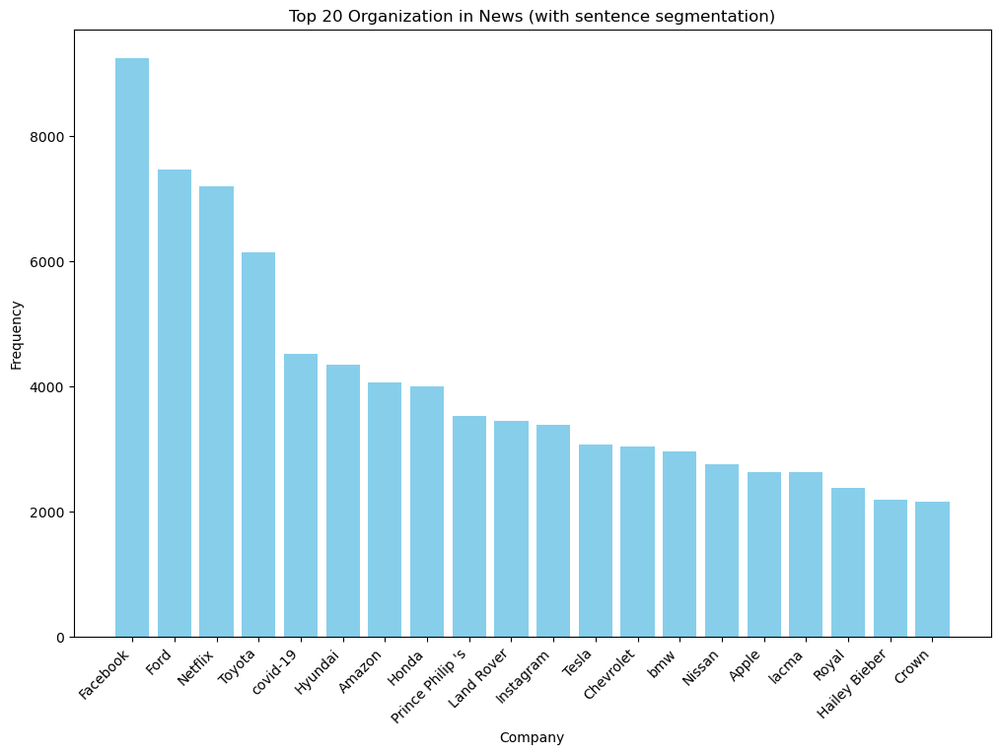
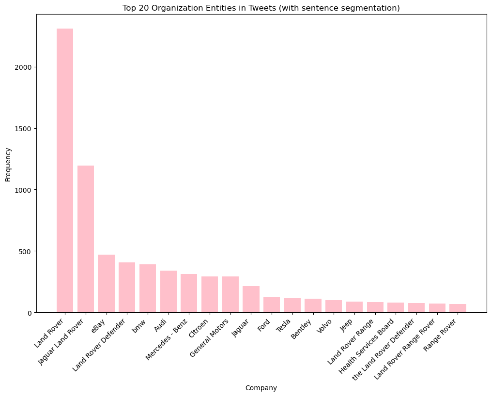
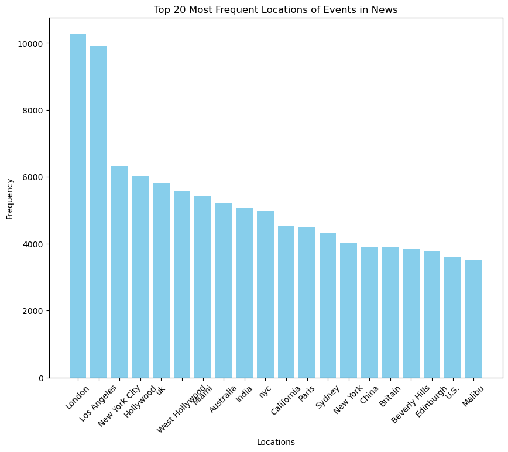
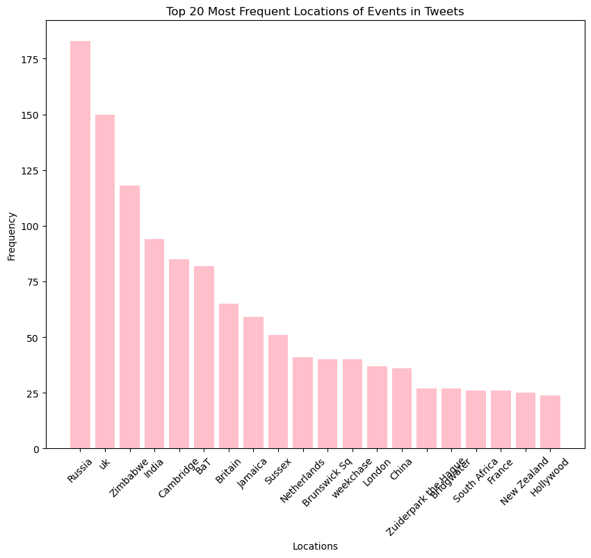
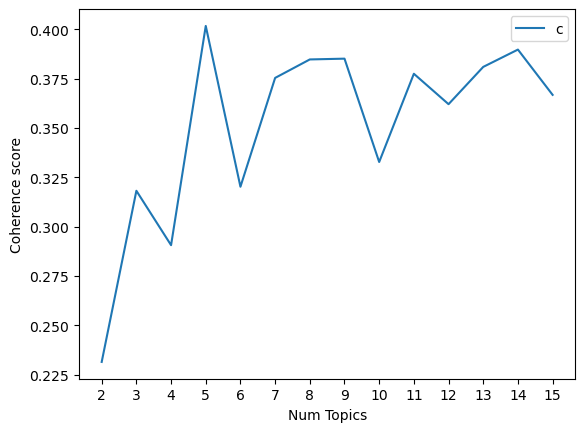

# Company Analysis: Named Entity Recognition and Topic Modeling

This project analyzes tweets and news articles about a specific company to identify:
- **Frequently mentioned companies and locations**
- **Most discussed topics in the media and social platforms**

The project was developed as part of the University of Chicago Applied Data Science program.  
It is designed so **both technical and non-technical readers** can quickly understand the results.

---

## 📌 Project Goals
1. **Identify key entities** — such as companies and locations — mentioned alongside the target company.
2. **Discover trending topics** from tweets and news articles.
3. **Visualize findings** so that business stakeholders can gain quick insights.

---

## 📊 Key Insights at a Glance

### 1) Top 20 Companies — News
These are the companies most frequently mentioned in **news articles** alongside the target company.  


### 2) Top 20 Companies — Tweets
These are the companies most frequently mentioned in **tweets** about the target company.  


### 3) Top 20 Locations — News
Top **geographic locations** linked to the target company in news articles.  


### 4) Top 20 Locations — Tweets
Top **geographic locations** linked to the target company in tweets.  


### 5) 🧩 Topic Modeling Results (Top 5 Topics)
Recurring discussion themes extracted from tweets and news articles using **LDA topic modeling**.  


The optimal N was selected based on the coherence score, which measures the degree of semantic similarity between high scoring words in each topic. A higher coherence score generally indicates the topics are more interpretable and meaningful. The goal is to choose N that ensures topics are distinct and informative, minimizing overlap while capturing the diversity of the discussion around the company in the tweets.

By visually inspecting the plot of coherence scores against the number of topics, we can identify a point where increasing the number of topics does not significantly improve the coherence score, or the score might even start to decline. This point is often a good choice for N, balancing topic quality with manageability.

**Topic 0: Microsoft's Software and Corporate Achievements**  
*Keywords:* microsoft, ever, number, window, year, own, word, use, know, activision

**Topic 1: Microsoft in the Tech Ecosystem**  
*Keywords:* microsoft, ceo, premium, netflix, grammarly, apple, canva, spotify, account, quillbot

**Topic 2: Microsoft's Products and Services**  
*Keywords:* microsoft, use, new, excel, know, work, business, today, learn, xbox

**Topic 3: Microsoft's Community and Engagement**  
*Keywords:* microsoft, amp, get, one, power, time, team, like, free, take

**Topic 4: Microsoft and the Gaming Industry**  
*Keywords:* microsoft, game, buy, xbox, sony, billion, like, google, company, activision


---

## 🔍 How It Works (Non-Technical Overview)

1. **Collect Data** — Tweets and news articles related to the company were gathered.
2. **Clean Data** — Removed non-English content and irrelevant text.
3. **Identify Entities** — Used NLP techniques to detect companies and locations.
4. **Extract Topics** — Applied Latent Dirichlet Allocation (LDA) to find discussion themes.
5. **Visualize Results** — Generated charts and tables for easy interpretation.

<p align="center">
  <br>
  <em>Example workflow output from Named Entity Recognition</em>
</p>

---

## 🧠 Why This Matters
- **Entity Recognition** reveals **who** and **where** is most often associated with the company.
- **Topic Modeling** shows **what** people are talking about.
- This approach helps companies **monitor brand reputation** and **spot emerging issues early**.

---

## 📂 Repository Structure
```plaintext
.
├── Company Analysis_Starter1.ipynb           # Part A: Named Entity Recognition
├── Company Analysis_Starter2.ipynb           # Part B: Topic Modeling
├── Company_Entity_Analysis.html              # HTML output for NER
├── Company_Topic_Modeling_Analysis.html      # HTML output for Topic Modeling
├── images/                                   # Extracted charts and figures
└── README.md                                 # Project description (this file)
```

## 🚀 How to View or Reproduce Results

### For Non-Technical Readers
Simply open the HTML files in your browser to explore the analysis:

- `Company_Entity_Analysis.html`
- `Company_Topic_Modeling_Analysis.html`

**No installation or coding is required.**

---

### For Technical Readers
If you want to reproduce the analysis from scratch:

1. **Clone this repository**
   ```bash
   git clone https://github.com/edwnhsu/company-analysis.git
   cd company-analysis
   ```

2. **Create a Python virtual environment (recommended)**
   ```bash
   python -m venv venv
   source venv/bin/activate  # Mac/Linux
   venv\Scripts\activate     # Windows
   ```

3. **Install dependencies**
   ```bash
   pip install -r requirements.txt
   ```

4. **Run the Jupyter Notebooks**
   ```bash
   jupyter notebook
   ```

   Then open the following notebooks manually in your browser:

   - **Company Analysis_Starter1.ipynb** — to run **Named Entity Recognition (NER)**
   - **Company Analysis_Starter2.ipynb** — to run **Topic Modeling**

5. **View Results**
   - **Outputs** will be saved as `.html` files in the project root.
   - **Figures** will be saved in the `images/` directory.
